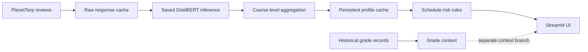

# TerpLoad production architecture

Workload risk is derived only from PlanetTerp review text classified by the
saved DistilBERT model. Historical grades are contextual information and do
not feed the workload classifier or schedule-risk score.
